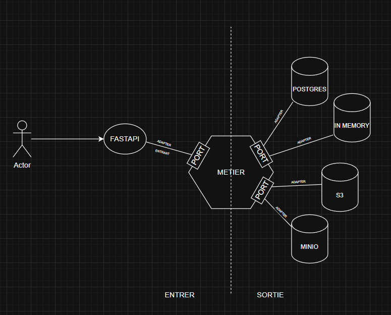

# 🚂 Track&Train Backend

> **A modern, modular, and testable backend for fitness & coaching platforms, built with Python, FastAPI, and a full Hexagonal Architecture.**

---

## 🏗️ Project Architecture



- **Entrypoints**: FastAPI routers, schemas, and dependencies
- **Domain**: Pure business logic, models, and service orchestration
- **Adapters**: Infrastructure for SQL (Postgres/SQLAlchemy) and in-memory (for tests)
- **Tests**: Full test coverage for all features using in-memory adapters

---

## ✨ Features

- 🧑‍💼 **User & Coach Management**: Register, login, promote users to coaches, manage roles
- 🏋️ **Group Management**: Create, update, delete, join/leave groups, add/remove members
- 🏆 **Training & Exercise**: CRUD for trainings and exercises
- 🍽️ **Diet**: CRUD for diets
- 🔐 **JWT Auth**: Secure endpoints with role-based access
- 🧩 **Hexagonal Architecture**: Clean separation of concerns, easy to test and extend
- 🧪 **Comprehensive Tests**: All business logic tested with in-memory adapters
- 🚀 **Hot Reload**: Fast development with Docker volume binding

---

## ⚙️ Installation & Usage

### 1️⃣ Local Development

```bash
# 1. Copy environment variables
cp .env.example .env
# 2. Edit .env to set your secrets and DB connection

# 3. Create and activate a virtual environment
uv sync
source .venv/bin/activate

# 4. Start the API (with hot reload)
uvicorn src.main:app --reload --host 127.0.0.1 --port 8000
```

- The API will be available at [http://127.0.0.1:8000/docs](http://127.0.0.1:8000/docs)

### 2️⃣ Docker Compose (API + Postgres)

```bash
# 1. Copy environment variables
cp .env.example .env
# 2. Edit .env as needed

# 3. Start everything (API + DB + hot reload)
docker compose up -d
```

- The backend is mounted with a volume on `src/` for instant code reload
- Database and backend are both started and networked automatically

---

## 🧪 Running Tests

- All tests are designed to run sequentially (not isolated per test)
- You can run all API tests in order with:

```bash
pytest src/entrypoints/api/tests/profile.py src/entrypoints/api/tests/group.py src/entrypoints/api/tests/exercise.py src/entrypoints/api/tests/training.py src/entrypoints/api/tests/diet.py
```

- You can also run a single test file if needed, but tests are designed to be run in sequence for full state setup.

---

## 📂 Main Project Structure

```
back/
├── src/
│   ├── __init__.py
│   ├── main.py                # FastAPI app entrypoint
│   ├── container.py           # Dependency injection container
│   ├── domain/
│   │   ├── model/             # Domain models (Profile, Group, etc.)
│   │   ├── services/          # Business logic (service layer)
│   │   ├── ports/             # Interfaces (repositories, etc.)
│   │   ├── exceptions.py      # Domain exceptions
│   ├── adapters/
│   │   ├── sqlalchemy/        # SQLAlchemy (Postgres) implementation
│   │   ├── inmemory/          # In-memory implementation for tests
│   ├── entrypoints/
│   │   ├── api/               # FastAPI routers, schemas, dependencies
│   │   └── tests/             # Pytest test files
│   └── ...
├── Dockerfile
├── docker-compose.yml
├── pyproject.toml
├── .env.example
└── README.md
```

---

## 📝 Example API Endpoints

- `POST   /profiles`           → Register user
- `POST   /profiles/login`     → Login
- `PATCH  /profiles/{id}/roles`→ Promote user to coach
- `POST   /groups`             → Create group (coach/admin)
- `GET    /groups`             → List all groups
- `GET    /groups/coachs/mine` → List all coaches for current user
- `POST   /groups/{group_id}/members/{user_id}` → Add member
- `DELETE /groups/{group_id}/leave` → Leave group
- ...and many more!

---

## 💡 Why Hexagonal Architecture?

- **Testability**: Swap adapters (SQL/in-memory) for real DB or fast tests
- **Maintainability**: Business logic is pure and isolated
- **Extensibility**: Add new adapters (e.g., REST, gRPC, CLI) without touching domain
- **Separation of Concerns**: Each layer has a single responsibility

---

## 🛠️ Contributing

- Fork, branch, and submit PRs!
- All new features should include tests
- Please update the changelog for any user-facing changes

---

## 🧑‍💻 Authors & License

- Made with ❤️ by the Track&Train team
- MIT License
